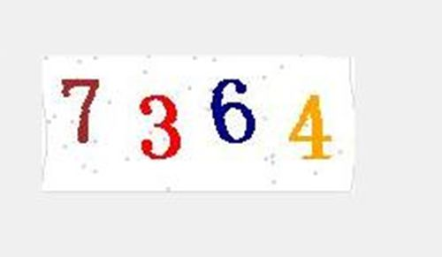
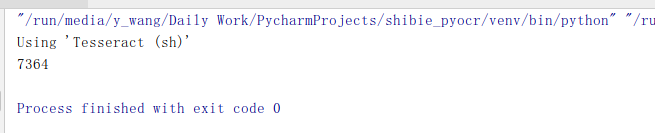
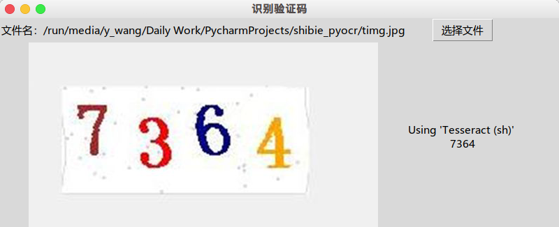

# 基于tesseract的图形验证码识别
## 必须程序包
* Python 3.7
* tesseract
* tesseract-data-???
## 必须的Python库
在requirements.txt文件中也有给出
* six == 1.11.0
* pyocr == 0.5.3
* Pillow == 5.3.0
## 操作步骤
1. 在Arch系系统下（比如目前DistroWatch上排名第一的Manjaro），打开终端，输入
sudo pacman -S tesseract 即可安装目前最新的 tesseract 3.05.01-6。
   > sudo pacman -S tesseract
   
   参考地址
   > https://github.com/tesseract-ocr/tesseract
2. **如果要利用tesseract进行识别，还需要安装特定的语言包**\
必备的语言数据包是英文的，使用 sudo pacman -S tesseract-data-eng命令安装。
如果还想解析中文的验证码，可以安装tesseract-data-chr软件包。
    > sudo pacman -S tesseract-data-eng\
    sudo pacman -S tesseract-data-chi_xxx
    
    参考地址
    > https://github.com/tesseract-ocr/tessdata
    
3. **关于一些类似的模块的说明**\
没有必要安装tesseract，pytesseract等等这些别人贡献的类库，经过实测这些类库的语言规范都是py2.x版本的，很多内容在python3.7当中是无法使用的，还有类似于tesseract库所import的voro库，在pip安装命令当中并没有找到，以及ConfigParser库在现在只有configparser库，种种很多错误，而且修改起来很麻烦，也很难改好，所以就不用这些。
    > pip install -r requirements.txt
4. **简陋代码实现**
   ```
    import pyocr
    import sys
    from PIL import Image

    tools = pyocr.get_available_tools()[:]
    if len(tools) == 0:
        print("no ocr tool found")
        sys.exit(1)
    else:
        print("Using '%s' " % (tools[0].get_name()))
    image = Image.open("timg.jpg")
    print(tools[0].image_to_string(image,lang="eng"))
    ```
5. **初步开发范例**
    
    原图：\
    \
    结果：\
    
6. **使用tkinter编写的程序**

    仅仅在控制台操作还是远远不够的，使用tk简单的写了一个GUI界面。
    
    
7. **tk GUI程序代码实现**
    > shibie.py